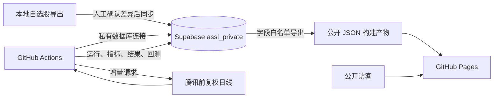

# ASSL — A-Share Signal Lab 设计规格

日期：2026-08-12  
状态：已获用户批准，等待书面规格复核  
仓库：`a-share-signal-lab`  
站点名称：ASSL — A-Share Signal Lab / A股信号实验室

## 1. 目标

ASSL 是一个公开访问、自动更新的 A 股技术面候选研究网站。系统每天从用户的私有自选股池中，用固定且可复现的 MACD、均线、背离和预测金叉规则筛选约 10 只候选，并持续记录历史结果与前向验证表现。

系统把两类判断分开：

- 私有的基本面与行业主线信息决定研究优先级；
- 可复现的技术指标决定候选排序、入场观察条件和失效条件。

网站只提供候选池和研究优先级，不把任何结果表述为确定买入建议。

## 2. 成功标准

1. 每个工作日北京时间约 06:17，网站显示最近一个已完成 A 股交易日的数据。
2. 完整自选股池、内部基本面标签、原始行情缓存和数据库凭据不会进入公开网站产物。
3. 每期候选可追溯到明确的行情截止日、自选股版本和算法版本。
4. 历史候选快照不可改写，未来收益结果只能追加。
5. 同一输入重复运行产生相同结果。
6. 数据异常时保留上次成功页面并显式提示失败，不能用旧名单冒充新结果。
7. 网站在桌面端和手机端均可清晰查看候选、风险与历史验证。

## 3. 范围

### 3.1 第一版包含

- 私有自选股版本管理与本地手动同步；
- 腾讯前复权日线 OHLCV 的初始回填和每日增量更新；
- MACD 12/26/9、MA20/30/60、底背离、顶背离和预测金叉；
- Top 10、P1、P2 和 3–5 只风险/未入选观察；
- 每期不可变历史快照；
- 固定持有期及信号退出两套前向验证；
- 公开静态网站、历史日期切换、股票详情和回测汇总；
- GitHub Actions 自动运行与手动补跑；
- 运行状态、覆盖率、缺失数据和方法说明。

### 3.2 第一版不包含

- 下单、券商连接、组合自动调仓或任何交易执行；
- 在公开网站中显示完整自选股池；
- 公开内部基本面评分或行业标签；
- 公开网站登录、用户账户、评论和社交功能；
- 网页端自选股管理后台；
- 盘中实时信号；
- 使用 QuantMind 构建大型知识库；
- 对外承诺收益或把历史结果包装成投资建议。

## 4. 总体架构

采用“Supabase 私有账本 + GitHub Actions 计算 + GitHub Pages 静态展示”的混合架构。

### 4.1 代码与技术边界

- 计算引擎：Python，复用并拆分现有 `screen_watchlist_macd.py` 的已验证逻辑；
- 数据库：用户现有 Supabase 项目中的独立 `assl_private` schema；
- 数据库访问：GitHub Actions 和本地同步工具使用 Supabase Postgres 连接串，存放于 GitHub Secret 或本地未提交环境变量；
- 前端：TypeScript + React + Vite，构建为纯静态文件；
- 图表：优先使用轻量 SVG/Canvas 组件，避免为第一版引入大型图表平台；
- 托管：公开 GitHub 仓库和 GitHub Pages；
- 网站运行时不连接私有 Supabase，也不包含 Supabase service role 或数据库凭据。

选择数据库连接串而不是浏览器或 REST 客户端访问私有 schema，是为了使 `assl_private` 保持不暴露于 Supabase Data API。连接凭据仅存在于可信的自动化环境。

## 5. 隐私与安全边界

### 5.1 私有数据

以下内容永不进入 Pages 产物、公开仓库文件或前端网络请求：

- 完整自选股名单及历次版本；
- 未入选且不属于公开风险观察的股票；
- 内部基本面优先级与行业标签；
- 全量股票的原始 OHLCV 缓存；
- 全量筛选中间结果；
- Supabase 数据库连接串、service role key 或其他私有凭据。

### 5.2 允许公开的数据

- 每日 Top 10；
- P1、P2 分组；
- 3–5 只风险/未入选观察；
- 每个公开候选的技术指标、关键价位、失效位及解释；
- 数据截止日、算法版本、数据源、覆盖率和缺失数量；
- 聚合后的历史胜率、平均收益、超额收益、MFE/MAE 和信号退出结果；
- 策略方法、假设和免责声明。

### 5.3 防泄漏措施

1. 发布器以显式字段白名单生成 JSON，禁止直接序列化数据库行。
2. 构建后扫描静态产物中的私有代码集合、数据库 URL、JWT/service key 特征和内部字段名。
3. 公开 JSON 只由成功且完整度达到阈值的运行生成。
4. GitHub Actions 日志不得输出自选股全集或密钥。
5. `.env*`、本地数据库配置、同步输入快照和调试转储必须被 `.gitignore` 排除。
6. Supabase 公开 Data API 不暴露 `assl_private` schema。

## 6. 数据模型

所有业务表位于 `assl_private` schema。时间统一存 UTC，交易日期使用中国市场自然日。

### 6.1 `watchlist_versions`

记录一次不可变的自选股版本：

- `id uuid primary key`
- `created_at timestamptz`
- `source text`
- `item_count integer`
- `content_sha256 text unique`
- `note text`

### 6.2 `watchlist_members`

- `watchlist_version_id uuid`
- `symbol text`
- `name text`
- `exchange text`
- `fundamental_priority smallint null`
- `theme_tags jsonb null`
- 主键：`(watchlist_version_id, symbol)`

股票池使用版本追加，不覆盖旧版本。某次筛选始终引用确定的 `watchlist_version_id`。

### 6.3 `daily_bars`

- `symbol text`
- `trade_date date`
- `open/high/low/close numeric`
- `volume numeric`
- `adjustment text`，固定为 `qfq`
- `source text`，第一版固定为 `tencent`
- `source_timestamp timestamptz`
- `ingested_at timestamptz`
- 主键：`(symbol, trade_date, adjustment, source)`

初始回填至少覆盖最早导入筛选日前 400 个交易日；以后只追加已完成交易日数据。第一版不主动清理历史 K 线，以支持复现和算法升级。

### 6.4 `algorithm_versions`

- `id text primary key`，例如 `macd-v1`
- `code_sha text`
- `config jsonb`
- `created_at timestamptz`
- `description text`

任何影响入选、排名、回测或失效条件的改动都必须创建新算法版本。

### 6.5 `screening_runs`

- `id uuid primary key`
- `as_of_date date`
- `watchlist_version_id uuid`
- `algorithm_version_id text`
- `status text`：`running/succeeded/failed/skipped`
- `universe_count integer`
- `covered_count integer`
- `coverage_ratio numeric`
- `missing_symbols jsonb`
- `source_timestamp timestamptz`
- `started_at/finished_at timestamptz`
- `error_stage/error_summary text null`
- 唯一约束：`(as_of_date, watchlist_version_id, algorithm_version_id)`

### 6.6 `signal_results`

保存每次运行中所有股票的私有计算结果：

- `run_id uuid`
- `symbol text`
- `overall_rank integer null`
- `public_bucket text null`
- `signal_channel text`
- `grade text`
- `signal_date date`
- `dif/dea/macd_hist/gap numeric`
- `gap_convergence numeric null`
- `x1 numeric null`
- `x1_change_pct numeric null`
- `projected_days numeric null`
- `ma20/ma30/ma60 numeric`
- `close_vs_ma20/ma30/ma60 numeric`
- `volume_ratio_5_20 numeric`
- `bottom_divergence/top_divergence boolean`
- `confirm_price/invalidation_price numeric null`
- `details jsonb`
- 主键：`(run_id, symbol)`

核心查询字段使用明确列；背离枢轴、解释证据和扩展指标放入 `details`。

### 6.7 `published_snapshots`

保存经过字段白名单检查的公开快照：

- `run_id uuid primary key`
- `as_of_date date`
- `algorithm_version_id text`
- `payload jsonb`
- `payload_sha256 text`
- `published_at timestamptz`
- 唯一约束：`(as_of_date, algorithm_version_id)`

快照成功发布后不可修改。未来表现存储在独立表并在导出时合并。

### 6.8 `candidate_outcomes`

- `run_id uuid`
- `symbol text`
- `model text`：`fixed_horizon` 或 `signal_exit`
- `horizon_days integer null`：1、5、10、20
- `entry_date/entry_price`
- `exit_date/exit_price`
- `gross_return/net_return numeric`
- `benchmark_return/excess_return numeric`
- `mfe/mae numeric`
- `exit_reason text null`
- `cost_model_version text`
- `updated_at timestamptz`
- 按模型建立唯一约束，防止重复结果。

## 7. 自选股手动同步

第一版不建设网页管理后台，提供本地命令行同步工具。

流程：

1. 用户从现有自选系统生成最新完整导出；
2. 本地运行同步命令，默认只执行 dry-run；
3. 显示旧版本、新版本、增加、删除、改名和总数变化；
4. 用户明确确认后，以单个数据库事务写入新版本和全部成员；
5. 内容哈希与现有最新版本一致时不创建重复版本；
6. 同步结果打印版本 ID 和数量，不打印完整自选股名单；
7. 下一次筛选自动采用最新已完成版本。

本地凭据只保存于未提交的 `.env.local` 或操作系统密钥存储。若现有 Supabase 已有可稳定读取的上游自选股表，适配器可以从该表生成同样的标准化输入；ASSL 仍保留自己的不可变版本表，避免上游直接修改破坏历史复现。

## 8. 行情采集

### 8.1 数据口径

- 数据源：腾讯行情接口；
- 周期：日线；
- 复权：前复权；
- 字段：OHLCV；
- 只使用实际已完成交易日；
- 接口响应必须记录来源时间戳。

### 8.2 增量策略

- 首次为股票补足至少 400 个交易日；
- 日常仅请求数据库最新交易日之后的数据，并保留小范围重叠窗口用于校验修订；
- 股票分批请求，限制并发并采用指数退避重试；
- 同一主键重复返回时比较内容，异常修订进入日志；
- 少量缺失可以继续，覆盖率低于发布阈值时停止发布。

第一版发布阈值固定为 `98%`。低于阈值的运行标记失败；达到阈值时允许发布，但页面必须显示缺失数量，缺失股票不参与排名。

## 9. 信号规则

参数固定：MACD `12/26/9`，均线 `MA20/MA30/MA60`。

### 9.1 A：已确认趋势启动

- 近 3 个交易日 DIF 上穿 DEA；
- 近 5 日 DIF 上穿零轴作为加分；
- MACD 柱连续 2–3 日增强作为加分；
- 收盘站上或回踩守住 MA20/30/60；
- 中期均线尽量走平或向上。

### 9.2 B：常规底背离修复

- 在过去 60 个交易日内寻找两个已确认局部低点；
- 两低点相隔 5–30 个交易日；
- 局部低点确认只能使用筛选日当时已知数据，禁止未来函数；
- 第二个价格低点不高于第一个，允许 1% 容差；
- 第二低点对应的 DIF 或 MACD 柱低点高于前低；
- 第二低点后至少出现 DIF/柱体回升、柱体连续增强或 DIF 上穿 DEA 之一。

### 9.3 C：潜在/预测金叉

- 当前 `DIF < DEA`，`g = DEA - DIF > 0`；
- `g` 至少连续 2 日缩小；
- 绿柱同步连续缩短；
- `DIF[t] > DIF[t-1]`；
- 最近 2 日平均 `ΔDIF > ΔDEA`；
- 用 EMA 递推精确反解下一交易日满足 `DIF >= DEA` 的最低收盘价 `X1`；
- 投影天数为当前 `g / 最近2日平均收敛速度`。

P1：投影不超过 1.5 日，且 `X1 <= 当前收盘 × 1.015`。  
P2：投影不超过 3 日，且 `X1 <= 当前收盘 × 1.03`。

预测金叉附加约束：

- 价格不低于 `MA20 × 0.97`；
- MA20 不显著恶化；
- 5 日/20 日量能不低于 0.70；
- 无近期明显顶背离；
- 若 `g` 重新连续 2 日扩大，或价格跌破 MA20 约 1.5%，标记失效。

预测信号只作为条件性观察，不表述为必然发生。

### 9.4 顶背离

- 第二个价格高点不低于前高；
- 对应 DIF 或 MACD 柱高点低于前高；
- 明显近期顶背离只作为风险扣分或风险观察，不能进入正向 Top 10。

### 9.5 共振等级

- 强S：确认底背离 + 近3日确认金叉，并满足上穿零轴、站上 MA20/30/60、量能改善中的多数条件；
- S：确认底背离 + 近3日确认金叉；
- A+：确认底背离 + P1；
- A：确认底背离 + P2；
- 单独确认金叉或单独潜在金叉降低一级；
- 同等基本面质量下，单独信号不得排在背离共振者之前；
- 每只股票只进入其最高等级与单一公开分组。

### 9.6 排名

先考虑私有基本面/行业主线优先级，再依次综合：

1. 共振等级；
2. 信号新鲜度；
3. 零轴位置；
4. 柱体改善；
5. MA20/30/60 结构；
6. 量价配合；
7. 顶背离风险。

公开结果约 10 只，并另列 P1、P2 与 3–5 只风险/未入选观察。基本面优先级只影响排序，不在公开页面显示。

`fundamental_priority` 使用固定的三档私有值：2 为核心研究、1 为一般关注、0 为未标注。缺失值按 0 处理，但不因此排除股票。技术等级顺序及同等级内的各项权重、舍入和最终代码顺序兜底规则，都必须冻结在 `algorithm_versions.config` 中，确保排序完全确定；不能依赖数据库返回顺序。

## 10. 前向验证与回测

### 10.1 不可变性

信号日 T 的候选快照只使用 T 日收盘及以前的数据。一旦发布，不因未来行情或算法修改而改写。新算法使用新的版本号单独统计。

### 10.2 固定持有期主口径

- 信号生成：T 日收盘后；
- 模拟入场：T+1 开盘；
- 观察期：1、5、10、20 个交易日；
- 1 日退出：T+1 收盘；其余在对应交易日收盘退出；
- 基准：沪深300，同一入场和退出时间口径；
- 统计：毛收益、净收益、胜率、相对沪深300超额收益、MFE、MAE；
- 成本模型 `cost-v1`：买入和卖出各扣 10 bps 的全包模拟成本，不模拟最低佣金；
- 复牌、停牌或缺失开盘价时不猜测成交，记录为不可评估并解释原因。

### 10.3 信号退出辅助口径

持有期间若收盘确认以下任一条件，则模拟在下一可交易日开盘退出：

- `g` 连续 2 日扩大；
- 价格跌破 MA20 约 1.5%；
- 新出现明确顶背离；
- 其他由算法版本明确记录的失效规则。

该口径与固定持有期分开展示，不能混成同一胜率。

### 10.4 公开统计防误导

- 显示样本数和已到期样本数；
- 已到期样本少于 30 时标注“样本不足”，不在首页突出胜率；
- 不使用当天尚未完成的数据；
- 不把不同算法版本合并；
- 明确区分回溯导入结果与网站上线后的真实前向记录。

## 11. 自动运行流程

GitHub Actions 提供定时触发和 `workflow_dispatch` 手动触发。

计划时间为北京时间工作日约 06:17。若工作流使用 UTC cron，则配置为前一日 22:17，并在程序内部按 `Asia/Shanghai` 判断日期。GitHub 定时任务不保证精确到分钟，因此网站以实际运行完成时间为准。

单次流程：

1. 获取最近一个已经完成的 A 股交易日；
2. 读取最新自选股版本和算法版本；
3. 以三元组检查幂等性；
4. 增量更新腾讯前复权行情；
5. 校验日期、OHLCV、复权口径和覆盖率；
6. 更新已经满足退出条件的历史候选结果；
7. 计算本期全量私有指标；
8. 排名并生成公开候选；
9. 在数据库事务中写入运行、指标和公开快照；
10. 从已发布快照生成静态 JSON；
11. 执行隐私扫描、结构校验和前端测试；
12. 通过后构建并部署 GitHub Pages。

非交易日或没有新增行情时，运行标记为 `skipped`，不重复发布旧榜单。

## 12. 失败处理

- 单只股票接口失败：重试后记录缺失，达到覆盖率阈值则继续；
- 覆盖率不足：运行失败，不生成新公开快照；
- 数据日期不一致：运行失败；
- Supabase 暂不可用：运行失败，Pages 保持上次成功版本；
- 同一输入重复触发：返回既有成功运行，或安全续跑失败运行，不产生重复记录；
- 构建或隐私扫描失败：禁止部署；
- 算法异常：记录失败阶段和简短错误，不在公开日志泄漏私有数据；
- 网站始终显示“数据截至日期”和“最后成功更新时间”，必要时显示本期失败提示。

## 13. 网站信息架构

### 13.1 视觉规范

采用已批准的“ChatGPT 式克制界面气质”，但使用 ASSL 独立品牌：

- 中性灰白背景、充足留白、弱边框和克制圆角；
- 使用系统无衬线字体，不使用 OpenAI Sans；
- 不使用 OpenAI/ChatGPT 名称、Logo、图标或专有品牌资产；
- 红绿仅用于 A 股涨跌与风险语义，主界面不使用大面积金融终端色；
- 优先自然阅读和层级，不做高密度后台管理界面；
- 桌面为浅灰侧栏 + 居中内容，手机隐藏侧栏并保留核心列表。

### 13.2 页面

**今日信号**

- 数据日期与运行完整度；
- 自然语言“今日信号摘要”；
- 强共振、P1、P2、5日胜率与平均超额摘要；
- Top 10 阅读列表；
- P1/P2 分组；
- 风险观察；
- 历史组合表现和固定持有期验证摘要。

**股票详情**

- 代码、名称、信号类型与发生日期；
- DIF、DEA、MACD柱、`g`、收敛速度；
- X1、所需涨跌幅和投影天数；
- MA20/30/60 及收盘相对位置；
- 量能变化；
- 底/顶背离；
- 共振等级、简短理由；
- 关键确认位、失效位和风险；
- 该候选后续 1/5/10/20 日结果。

**历史记录**

- 按交易日浏览不可变榜单；
- 显示当期算法版本、股票池版本摘要、覆盖率和缺失项；
- 不允许从历史页面推断完整自选池。

**策略回测**

- 按算法版本、信号等级和持有期查看；
- 展示样本数、胜率、平均/中位收益、平均超额、MFE/MAE；
- 固定持有期与信号退出分开；
- 明确回溯样本与真实前向样本。

**方法说明**

- 信号定义、排名逻辑、回测口径、成本模型、数据源、已知限制和免责声明。

## 14. 测试策略

### 14.1 算法测试

- MACD 12/26/9 与 EMA 递推固定样本；
- MA20/30/60；
- 金叉、零轴、柱体增强；
- 底背离和顶背离的正例、反例与边界；
- P1/P2、X1 精确反解和投影天数；
- 预测金叉失效；
- 等级去重和排名稳定性。

### 14.2 防未来函数测试

- 局部高低点不能使用筛选日之后的数据；
- 信号日 T 不能访问 T+1 开盘；
- 收盘触发的信号退出只能使用下一可交易日开盘成交；
- 回测基准采用相同时间窗口。

### 14.3 数据与复现测试

- 交易日、前复权、重复 K 线、异常 OHLC 和缺失量；
- 同输入重复运行结果哈希一致；
- 不同算法版本结果隔离；
- 自选股版本变化不会改写旧运行。

### 14.4 安全测试

- Pages 产物中不存在私有代码全集、内部字段和凭据特征；
- `assl_private` 不在公开 Data API schema 列表；
- 前端源码和请求不包含 Supabase 私有连接信息；
- GitHub Actions 权限使用最小化设置。

### 14.5 网站与流程测试

- 桌面、手机、窄屏；
- 历史日期切换、详情、图表和空状态；
- 腾讯接口部分失败、Supabase 不可用、重复运行、周末和节假日；
- 失败时保留上次成功站点；
- 至少两个历史交易日完成端到端试运行后再启用正式定时任务。

## 15. 上线顺序

1. 新建公开 GitHub 仓库，但暂不启用 Pages；
2. 只读核对用户现有 Supabase 项目和上游自选表；
3. 在同一项目中新建 `assl_private` schema 和迁移；
4. 导入当前自选股版本和现有 2026-08-07 至 2026-08-12 的筛选快照；
5. 完成行情增量层、指标引擎和测试；
6. 完成结果账本和两套回测；
7. 完成已批准视觉方向的静态网站；
8. 配置 GitHub Secrets 和手动工作流；
9. 连续运行至少两个历史交易日的端到端验收；
10. 启用 Pages 和工作日 06:17 定时任务；
11. 检查公开站点产物后向朋友分享。

## 16. 运行维护

- 自选股变化时由用户运行本地同步工具并确认差异；
- 算法变化必须新建版本并分开统计；
- 行情源异常时允许手动重跑，不手工篡改结果；
- 每次部署保留运行日志、数据覆盖和产物哈希；
- 定期检查 Supabase 安全与性能建议；
- 腾讯接口属于非交易所正式数据源，网站必须持续披露来源与可能的延迟、缺失或修订风险。

## 17. 最终免责声明

ASSL 的结果用于缩小研究范围和安排研究优先级。技术信号可能失效，历史或前向验证结果不保证未来表现。网站不提供自动交易，也不构成确定买入、卖出或收益承诺。
